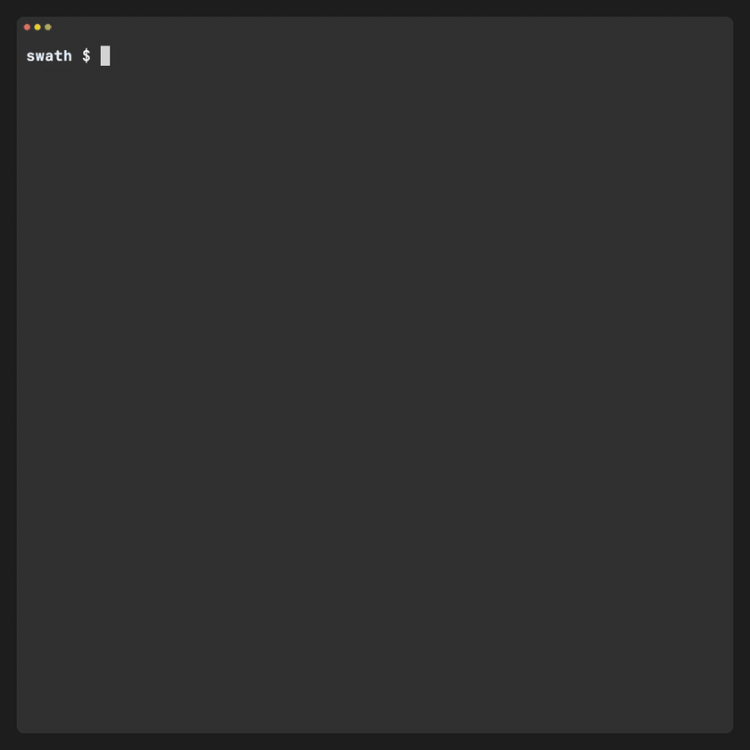

[](https://github.com/varveio/swath/actions/workflows/ci.yml)

# swath

**Parallel, resumable S3 listing for very large buckets.**

`swath` is an open-source CLI for finding out **what is in a very large S3 bucket
right now**. It turns a live `ListObjectsV2` scan into a stream or a query-ready
Parquet inventory, filling the gap between a simple `aws s3 ls` or SDK loop and a
precomputed S3 Inventory.

- **Parallel without pre-partitioning.** swath learns the bucket's key distribution while
  it lists, then moves work from dense ranges to idle workers. Flat keys, deep prefix
  trees, and badly skewed layouts do not need different partitioning scripts.
- **Resume instead of restarting.** Managed Parquet output checkpoints progress and
  resumes after Ctrl+C or a crash, while keeping active memory buffers bounded.
- **Analyze without downloading objects.** swath reads metadata only. Stream a table,
  TSV, or JSONL—with optional gzip or Zstandard compression—to stdout or a file; TSV
  and JSONL can also publish a bounded parallel directory dataset. Or query the Parquet
  result directly with tools such as DuckDB.

Use swath when a fresh S3 Inventory or S3 Metadata table is unavailable, stale, or
controlled by somebody else, and a serial listing is too slow.

**Want to understand how swath works? Read the
[visual field guide](https://swath.varve.io/field-guide/).** It explains why S3 listing
is difficult to parallelize, then walks through swath's range model, safe splitting,
work stealing, checkpoints, and the cases where swath is not the right tool.

[](https://swath.varve.io/runs/noaa-gestofs-pds/)

*A real 39.6-million-object run: one of 513 initial range guesses held 68% of the
bucket. swath discovered the imbalance while listing and split the busy ranges so idle
workers could help. [Explore the run trace](https://swath.varve.io/runs/noaa-gestofs-pds/)
or [see the visual field guide](https://swath.varve.io/field-guide/).*

<a id="quickstart"></a>

## Try it

This is the exact listing shown in the demo. It scans the entire public NOAA bucket and
saves a resumable Parquet dataset. The recorded run listed 39.6 million objects, made
41,582 S3 API calls, wrote 790.8 MB of Parquet, and peaked at about 1.7 GB of resident
memory (RSS). Review the [request-cost guidance](docs/operating.md#request-cost) before
running it. This is a full-scale demonstration, not a lightweight smoke test:

```bash
mkdir -p out
docker run --rm --user "$(id -u):$(id -g)" -v "$PWD/out:/out" \
  ghcr.io/varveio/swath:latest \
  list s3://noaa-gestofs-pds/ \
  --no-sign-request --region us-east-1 \
  --concurrency 128 \
  --format parquet -o /out/noaa-gestofs-pds
```

If the DuckDB CLI is installed, query the result directly—there is no conversion or
compaction step:

```bash
duckdb -c "SELECT count(*) FROM read_parquet('out/noaa-gestofs-pds/data/*.parquet')"
```

If the listing is interrupted, resume it by passing the same output directory:

```bash
docker run --rm --user "$(id -u):$(id -g)" -v "$PWD/out:/out" \
  ghcr.io/varveio/swath:latest resume /out/noaa-gestofs-pds
```

`--concurrency` is an adaptive ceiling rather than a fixed request count; see
[Choosing concurrency](docs/configuration.md#choosing-concurrency) before raising it.

For a private bucket, remove `--no-sign-request`, use the bucket's region, and pass
credentials into the container. Docker does not automatically inherit a host AWS profile;
see [Credentials in Docker](docs/operating.md#credentials-in-docker) for environment,
shared-profile, and workload-role paths.

The [getting-started guide](docs/getting-started.md) walks through the same flow with
expected files, a Docker-only DuckDB option, private credentials, resume behavior, and
troubleshooting routes.

Building from source requires JDK 25:

```bash
./gradlew :swath-cli:installDist
export PATH="$PWD/swath-cli/build/install/swath/bin:$PATH"
swath list s3://noaa-gestofs-pds/ \
  --no-sign-request --region us-east-1 \
  --concurrency 128 \
  --format parquet -o out/noaa-gestofs-pds
swath resume out/noaa-gestofs-pds
```

## How it works

Imagine that one worker owns the key range `(A, Z]`. It lists forward from `A`. When
another worker becomes idle, swath chooses a pivot such as `M` and atomically changes
the ownership to two adjacent ranges:

```text
before:  worker 1  (A ------------------------------- Z]
after:   worker 1  (A ------------- M]  worker 2  (M - Z]
```

The ranges touch but never overlap, and the boundary belongs to exactly one side. If
the upper range is sparse it finishes quickly and steals again; if it is dense it keeps
a worker busy. Real keys and observed density improve later pivots, so a poor initial
guess does not condemn the rest of the run.

Checkpointing follows the same ownership model. A page's cursor is committed before
its rows enter the output pipeline. A finalized Parquet part is durable; after a crash,
swath may re-list an unfinished tail but does not rewrite finalized parts. The exact
range, split, and resume contracts are documented under
[internals](docs/internals/overview.md).

## When to use it

- Large general-purpose S3 buckets with unknown, skewed, flat, or deeply nested key
  distributions.
- Listings where S3 Inventory or S3 Metadata is unavailable, stale, or controlled by
  somebody else.
- Streaming with bounded active buffers into Parquet, JSONL, TSV, or a terminal table.
- Long-running inventories that need crash-safe checkpoint and resume.
- Producing globally sorted Parquet when downstream readers require key order (opt-in;
  unsorted output is the faster default).

swath reads listings only. It never fetches object contents. Filters are applied after
listing, so they reduce output size but not LIST requests.

## When not to use it

If a fresh S3 Inventory or S3 Metadata table already exists, query that instead. A
precomputed inventory is cheaper than any live `ListObjectsV2` scan. For small buckets,
the AWS CLI or an SDK loop may also be simpler.

Every run costs roughly one LIST request per 1,000 returned keys, plus probes, retries,
and any unfinished tail re-listed after interruption. swath reports its actual request
count; see [operating swath](docs/operating.md) before pointing it at a very large or
requester-pays bucket.

## Status and limits

swath is **pre-1.0**. The `list` and `resume` commands, managed Parquet datasets,
checkpoint/resume, and opt-in global sorting are implemented and tested. Flags and
schemas may still change before 1.0.

Current scope:

- general-purpose S3 buckets with globally ordered listings and `StartAfter`;
- object listing only—version history and delete markers are not listed yet;
- local output; and
- JDK 25, with no preview features in shipped artifacts.

S3 directory buckets are rejected because their listing contract does not provide the
ordering this engine requires. See the [roadmap](ROADMAP.md) for planned work.

## Documentation

- **Start:** [getting started](docs/getting-started.md) and
  [installation](docs/install.md).
- **Use and operate:** [common workflows](docs/usage.md),
  [credentials and cost](docs/operating.md), [configuration](docs/configuration.md),
  [performance](docs/performance.md), and [troubleshooting](docs/faq.md).
- **Understand:** read the [visual field guide](https://swath.varve.io/field-guide/) first,
  then continue to the repository's [internals overview](docs/internals/overview.md),
  [architecture](docs/internals/architecture.md), [algorithms](docs/internals/algorithms.md),
  and [correctness contracts](docs/internals/contracts.md).
- **Contribute:** [contribution guide](CONTRIBUTING.md) and
  [testing guide](docs/ops/dev/TESTING.md).

## License

[Apache-2.0](LICENSE). Bundled third-party dependencies and their licenses are listed in
[THIRD_PARTY_NOTICES.md](THIRD_PARTY_NOTICES.md).
